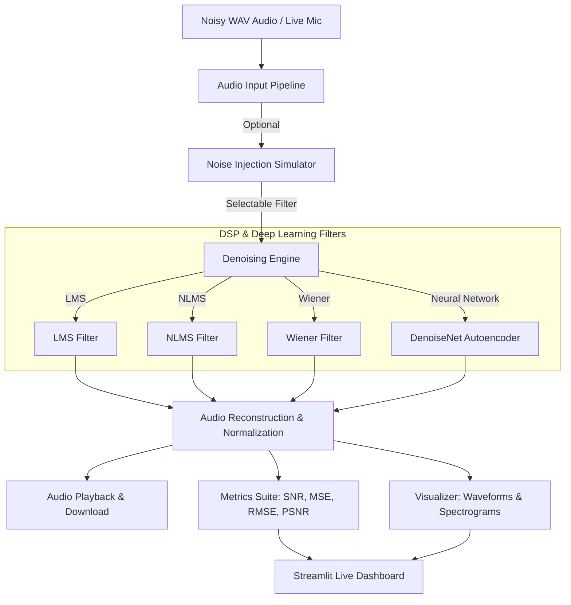

# 🎧 SoundShield AI

[](https://python.org)
[](https://pytorch.org)
[](https://streamlit.io)
[](#)

**SoundShield AI** is an enterprise-grade, real-time audio noise cancellation and speech enhancement system. By combining classic **Digital Signal Processing (DSP)** adaptive filters with state-of-the-art **Deep Learning Autoencoder architectures** (PyTorch), SoundShield AI cleans noisy audio files and live microphone feeds, providing real-time SNR monitoring, waveform visualization, and spectrogram analysis.

---

## 📸 Application Preview

### 📊 Real-Time Denoising Dashboard


*The SoundShield AI Dashboard allows users to upload custom WAV audio files or select preset samples, inject simulated noise (White Gaussian, Pink, or 50Hz AC Hum), adjust filter hyperparameters, and listen to the clean vs. denoised output side-by-side.*

### 🧠 Deep Learning Autoencoder Console


*The Deep Learning Center provides an interface to train and monitor the PyTorch `DenoiseNet` model in real-time, plotting loss curves and saving optimal model weights.*

---

## 🧠 System Architecture & Pipeline

SoundShield AI supports batch command-line execution and an interactive Streamlit UI. Below is the signal processing and data flow:



### 👥 Meet the Denoising Engines
1. **LMS Filter (`LMSFilter`)**: A time-domain adaptive filter that utilizes the Least Mean Squares algorithm to continuously update filter coefficients based on the error between the desired noisy signal and a noise reference signal.
2. **NLMS Filter (`NLMSFilter`)**: An improved version of LMS that normalizes the step size ($\mu$) by the energy of the input vector, ensuring faster convergence and numerical stability across varying signal levels.
3. **Wiener Filter (`wiener_filter`)**: A frequency-domain speech enhancement filter that computes a transfer function based on estimated clean signal power and noise power, minimizing the mean squared error (MSE) across the frequency spectrum. Excellent for stationary noise.
4. **Deep Autoencoder (`DenoiseNet`)**: A fully connected PyTorch neural network that maps noisy 1024-sample audio chunks into a low-dimensional latent space (512 $\to$ 256) and reconstructs the clean signal counterpart, resolving non-stationary and complex noise patterns.

---

## 🛠️ Technical Stack & Dependencies

### 💻 Frontend & Visualization
- **Dashboard Framework**: Streamlit
- **Visualization**: Matplotlib (Waveform & Spectrogram rendering)
- **Audio I/O**: Streamlit Audio Player & Download components

### ⚙️ Digital Signal Processing
- **Audio Processing**: SoundFile & SciPy (polyphase resampling, windowing, FFT)
- **Mathematical Computation**: NumPy (vectorized matrix operations, linear algebra)

### 🧠 Machine Learning & Live Mic
- **Neural Network Framework**: PyTorch (CUDA-accelerated)
- **Microphone Stream**: SoundDevice (real-time input/output buffer streaming)

---

## 📂 Project Structure

```bash
AI-Based-Real-Time-Noise-Cancellation-System/
│
├── app/                      # Streamlit UI Client
│   └── app.py                # Main Streamlit dashboard script
│
├── configs/                  # Configuration Layer
│   └── config.yaml           # Global parameters and model settings
│
├── filters/                  # Digital Signal Processing Algorithms
│   ├── lms.py                # Least Mean Squares Filter
│   ├── nlms.py               # Normalized Least Mean Squares Filter
│   └── wiener.py             # Wiener frequency-domain filter
│
├── ml_model/                 # Deep Learning Pipeline (PyTorch)
│   ├── model.py              # DenoiseNet network architecture & inference
│   ├── train.py              # Live training script with synthetic pairs
│   └── weights/              # Serialized PyTorch models
│       └── denoise_model.pth # Trained model weights
│
├── realtime/                 # Real-time Microphone Processing
│   ├── mic_stream.py         # SoundDevice low-latency stream buffer
│   └── processor.py          # Unified processing entry point for filters
│
├── utils/                    # Utility Helpers
│   ├── audio.py              # Normalization, resampling, loading/saving, audio I/O
│   ├── metrics.py            # Evaluation metrics (SNR, MSE, RMSE, PSNR)
│   └── config.py             # YAML config parser
│
├── tests/                    # Testing Suite
│   └── test_pipeline.py      # Module tests for pipelines and filters
│
├── data/                     # Dataset Directory
│   ├── clean/                # Clean preset audio samples
│   └── noisy/                # Noisy preset audio samples
│
├── output/                   # Processed outputs (gitignored)
├── run.py                    # Main CLI pipeline entry point
├── requirements.txt          # Python dependencies
└── README.md                 # Project Documentation
```

---

## ⚙️ Installation & Setup

### 1️⃣ Clone the Repository
```bash
git clone https://github.com/Kishor055/AI-Based-Real-Time-Noise-Cancellation-System.git
cd AI-Based-Real-Time-Noise-Cancellation-System
```

### 2️⃣ Environment Setup
Create a virtual environment and install the required dependencies:

```bash
# Create virtual environment
python -m venv .venv

# Activate environment:
# Windows (PowerShell):
.venv\Scripts\Activate.ps1
# Windows (CMD):
.venv\Scripts\activate.bat
# Linux/macOS:
source .venv/bin/activate

# Install requirements
pip install -r requirements.txt
```

---

## ▶️ Usage Guide

### 🔹 Run Main Command-Line Pipeline
Process the default configured audio file using parameters from `configs/config.yaml`:
```bash
python run.py
```

### 🔹 Run Streamlit Dashboard Interface
Launch the interactive dashboard to upload, record, and denoise audio visually:
```bash
streamlit run app/app.py
```
Open **`http://localhost:8501/`** in your browser to interact with the application.

### 🔹 Run Unit & Pipeline Tests
Run the test pipeline to verify that all filters and utilities are operating correctly:
```bash
python -m tests.test_pipeline
```

### 🧠 Train the Neural Network Autoencoder
Generate synthetic training pairs using clean samples inside `data/clean` and train `DenoiseNet`:
```bash
python ml_model/train.py
```
*Note: The script automatically detects and utilizes CUDA/GPU if available for acceleration.*

---

## 📈 Use Cases & Impact

- 🎙️ **Podcast & Voiceover Cleansing**: Removes background ambient noise, room reverb, and white noise from recorded voice.
- 📞 **Real-Time Telephony & Conferencing**: Cancels powerline electrical hum (50Hz/60Hz) and steady state noises on phone calls.
- 🎤 **Live Microphone Noise Suppression**: Denoises live inputs directly from your audio interface before transmitting it downstream.
- 🎓 **Educational DSP Sandbox**: Serves as a perfect learning platform to compare classical adaptive signal processing with neural networks.

---

## ⭐ Support & Contributions

Contributions are welcome! Please follow these guidelines:
1. Fork the project.
2. Create a feature branch (`git checkout -b feature/NewFeature`).
3. Commit your changes (`git commit -m 'Add NewFeature'`).
4. Push to the branch (`git push origin feature/NewFeature`).
5. Open a Pull Request.

---

### 📌 Development Lead
**KISHOR KAKDE PATIL**  
[GitHub Profile](https://github.com/Kishor055)

---
*Developed with ❤️ to build cleaner audio experiences.*
