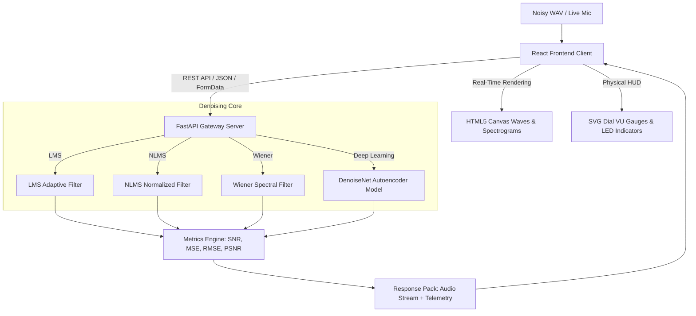

# SoundShield AI – Enterprise Real-Time Noise Cancellation Platform

[](https://python.org)
[](https://pytorch.org)
[](https://react.dev)
[](https://fastapi.tiangolo.com)
[](https://streamlit.io)
[](#)

**SoundShield AI** is an enterprise-grade, real-time audio noise cancellation and speech enhancement platform. By combining classic **Digital Signal Processing (DSP)** adaptive filters with state-of-the-art **Deep Learning Autoencoder models** (PyTorch), SoundShield AI cleans noisy audio files and live streams. The system features a futuristic, high-fidelity React dashboard and an alternative Streamlit playground for real-time SNR monitoring, waveform visualization, and spectrogram analysis.

---

## 📸 Application Preview

### 📊 Enterprise React Dashboard

*The SoundShield AI web client provides a premium, responsive HUD showing real-time canvas waveforms, scrolling spectrogram heatmaps, SVG VU dials, and interactive filter controls.*

### 🧠 Streamlit Audio Playground

*An alternative, lightweight Python Streamlit dashboard for testing raw files, recording live microphone samples, and adjusting step sizes with live plots.*

---

## 🧠 System Architecture & Pipeline

SoundShield AI leverages a decoupled **Client-Server Architecture** for low-latency computation and high-fidelity UI rendering:



### 👥 meet the Denoising Engines
1. **LMS Filter (`LMSFilter`)**: A time-domain adaptive filter that utilizes the Least Mean Squares algorithm to continuously update filter coefficients based on the error between the desired noisy signal and a noise reference signal.
2. **NLMS Filter (`NLMSFilter`)**: An improved version of LMS that normalizes the step size ($\mu$) by the energy of the input vector, ensuring faster convergence and numerical stability across varying signal levels.
3. **Wiener Filter (`wiener_filter`)**: A frequency-domain speech enhancement filter that computes a transfer function based on estimated clean signal power and noise power, minimizing the mean squared error (MSE) across the frequency spectrum. Excellent for stationary noise.
4. **Deep Autoencoder (`DenoiseNet`)**: A fully connected PyTorch neural network that maps noisy 1024-sample audio chunks into a low-dimensional latent space (512 $\to$ 256) and reconstructs the clean signal counterpart, resolving non-stationary and complex noise patterns.

---

## 🛠️ Technical Stack & Dependencies

### 💻 Frontend Client
- **Framework**: React 18 (Vite-powered SPA with TypeScript)
- **Styling**: Vanilla CSS (Custom Glassmorphism Design System)
- **Icons**: Lucide React
- **Visualizers**: HTML5 Canvas & SVG animations

### ⚙️ Backend API Server
- **Framework**: FastAPI (Asynchronous Python REST API)
- **Web Server**: Uvicorn
- **Audio I/O & DSP**: NumPy, SciPy (polyphase resampling, windowing, FFT), SoundFile

### 🧠 Machine Learning & Live Mic
- **Neural Network**: PyTorch (CUDA-accelerated)
- **Streaming**: SoundDevice (real-time input/output buffer streaming)

---

## 📂 Project Structure

```bash
AI-Based-Real-Time-Noise-Cancellation-System/
│
├── frontend/                 # React SPA Client
│   ├── dist/                 # Production compiled build (gitignored)
│   ├── src/
│   │   ├── App.tsx           # Main React Dashboard component (VU meters, Canvas)
│   │   ├── index.css         # Dark theme variables, glassmorphic styles
│   │   └── main.tsx          # Vite App entry point
│   ├── package.json          # Node dependencies
│   └── vite.config.ts        # Vite TS configuration
│
├── backend/                  # FastAPI Web Server
│   └── server.py             # REST API serving processing & training endpoints
│
├── app/                      # Streamlit UI Client
│   └── app.py                # Python Streamlit dashboard script
│
├── configs/                  # Configuration Layer
│   └── config.yaml           # Global parameters and model settings
│
├── filters/                  # Digital Signal Processing Algorithms
│   ├── lms.py                # Least Mean Squares Filter
│   ├── nlms.py               # Normalized Least Mean Squares Filter
│   └── wiener.py             # Wiener frequency-domain filter
│
├── ml_model/                 # Deep Learning Pipeline (PyTorch)
│   ├── model.py              # DenoiseNet network architecture & inference
│   ├── train.py              # Live training script with synthetic pairs
│   └── weights/              # Serialized PyTorch models
│
├── realtime/                 # Real-time Microphone Processing
│   ├── mic_stream.py         # SoundDevice low-latency stream buffer
│   └── processor.py          # Unified processing entry point for filters
│
├── utils/                    # Utility Helpers
│   ├── audio.py              # Normalization, resampling, loading/saving, audio I/O
│   ├── metrics.py            # Evaluation metrics (SNR, MSE, RMSE, PSNR)
│   └── config.py             # YAML config parser
│
├── tests/                    # Testing Suite
│   └── test_pipeline.py      # Module tests for pipelines and filters
│
├── requirements.txt          # Python dependencies
└── README.md                 # Project Documentation
```

---

## ⚙️ Installation & Setup

### 1️⃣ Clone the Repository
```bash
git clone https://github.com/Kishor055/AI-Based-Real-Time-Noise-Cancellation-System.git
cd AI-Based-Real-Time-Noise-Cancellation-System
```

### 2️⃣ Environment Setup
Create a virtual environment and install dependencies:

```bash
# Create virtual environment
python -m venv .venv

# Activate environment:
# Windows (PowerShell):
.venv\Scripts\Activate.ps1
# Windows (CMD):
.venv\Scripts\activate.bat
# Linux/macOS:
source .venv/bin/activate

# Install requirements
pip install -r requirements.txt
```

---

## ▶️ Running the Application

### 🔹 1. Start the FastAPI Backend Server
Launch the backend server to handle REST and processing requests:
```bash
python -m uvicorn backend.server:app --host 127.0.0.1 --port 8000 --reload
```

### 🔹 2. Start the Vite React Frontend Client
Open a new terminal, navigate to the frontend directory, install npm packages, and start the development server:
```bash
cd frontend
npm install
npm run dev
```
Open **`http://localhost:5173/`** in your browser to view the application.

### 🔹 3. (Alternative) Start the Streamlit Dashboard
If you prefer a Python-only interface, you can run the Streamlit app:
```bash
streamlit run app/app.py
```
Open **`http://localhost:8501/`** in your browser.

---

## 🧠 Training & Testing

### Train the Neural Network Autoencoder
Generate synthetic training pairs using clean samples inside `data/clean` and train `DenoiseNet`:
```bash
python ml_model/train.py
```
*Note: The script automatically detects and utilizes CUDA/GPU if available for acceleration.*

### Run Unit & Pipeline Tests
Run the test pipeline to verify that all filters and utilities are operating correctly:
```bash
python -m tests.test_pipeline
```

---

## 📈 Use Cases & Impact

- 🎙️ **Podcast & Voiceover Cleansing**: Removes background ambient noise, room reverb, and white noise from recorded voice.
- 📞 **Real-Time Telephony & Conferencing**: Cancels powerline electrical hum (50Hz/60Hz) and steady state noises on phone calls.
- 🎤 **Live Microphone Noise Suppression**: Denoises live inputs directly from your audio interface before transmitting it downstream.
- 🎓 **Educational DSP Sandbox**: Serves as a perfect learning platform to compare classical adaptive signal processing with neural networks.

---

## ⭐ Support & Contributions

Contributions are welcome! Please follow these guidelines:
1. Fork the project.
2. Create a feature branch (`git checkout -b feature/NewFeature`).
3. Commit your changes (`git commit -m 'Add NewFeature'`).
4. Push to the branch (`git push origin feature/NewFeature`).
5. Open a Pull Request.

---

### 📌 Development Lead
**KISHOR KAKDE PATIL**  
[GitHub Profile](https://github.com/Kishor055)

---
*Developed with ❤️ to build cleaner audio experiences.*
